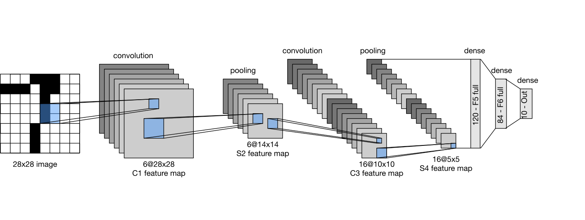

# 100 Days of ML
- daily ML Practice

# Certification:

## Convolutional Neural Networks:

### Day 001: Edge Detection
**NxN matrices are convolved by FxF filter/kernel; the output would be (N-F+1) by (N-F+1) matrices.**
- e.g., a 6x6 matrix is convolved by a 3x3 filter; the output would be a 4x4 matrix.
- F should always be odd, e.g., 3, 5, 7...
- This process shrinks the image.
- Information from corner/edge points is discarded.

## Limitation:
- Images shirinks
- Pixels in the edges are considered less than in the middle of the image.

1. **valid convolution**: No Padding
2. **same convolution**: Output image and input image size are equal.
## Padding
- By convention, padding is done with zeros.
**NxN matrices are convolved by FxF filter/kernel with padding of p; the output would be (N+2p-F+1) by (N+2p-F+1) matrices.**
- e.g., a 6x6 matrix is convolved by a 3x3 filter with padding of 1; the output would be a 6x6 matrix.
  - *Valid:* No padding (Image shrinks).
  - *Same:* p = (F-1)/2 (Retain original shape).

### Stride
**NxN matrices are convolved by FxF filter/kernel with padding of p and stride of S; the output would be `floor((N+2p-F)/S) + 1` by `floor((N+2p-F)/S) + 1` matrices.**
- e.g., a 6x6 matrix is convolved by a 3x3 filter with padding of 1 and strided with 2; the output would be a 3x3 matrix.
- e.g., a 7x7 matrix is convolved by a 3x3 filter with padding of 1 and strided with 2; the output would be a 4x4 matrix.
  
### Day 002:One Layer of a Convolutional Neural Network

-if Layer l is a convolution layer with:
  - filter size f[l], padding p[l], stride s[l] and no of filters nc[l]
  - if input activation from previous layer is : nh[l-1] x nw[l-1] x nc[l-1]
  - Output: nh[l] x nw[l] x nc[l]
  - nh[l] = floor([(nh[l-1]+2p[l] -f[l])/s[l] +1])
  - nw[l] = floor([(nw[l-1]+2p[l] -f[l])/s[l] +1])
  - Size of the each filter: f[l]x f[l] x nc[l-1]
  - activation: a [l] =  nh[l] x nw[l] x nc[l]
  - Weights : f[l] x f[l]  x nc[l]
  - Bias : nc[l]
  

## Example Convolutional Neural Network:
- if input image Size 39 x 39 x 3,filter size = 3 x 3, nh = 39, nw = 39, nc = 3
- for a **valid** convolution padding, p = 0, if stride s = 1, and we use 10 filters
- output image size 37 x 37 x 10,  nh = 37, nw = 37, nc = 10
- if we now use a 5x5 filter, with stride s= 2 and no padding p = 0, 20 filters
- output image size 17 x 17 x 20,  nh = 17, nw = 17, nc = 20
- if we now apply another a 5x5 filter, with stride s= 2 and no padding p = 0, 40 filters
- output image size 7 x 7 x 40,  nh = 7, nw = 7, nc = 40
-  flatten 7x 7 x 40 = 1960 units and feed to a logistic/softmax unit to predict ŷ

### Day 003: Lnet -5

    
    <em>Lnet-5</em>

### Day 004: Cats vs dogs - classification
https://blog.keras.io/building-powerful-image-classification-models-using-very-little-data.html

### Day 001: WordNet, word2vec, word embedding, bilingual word-embedding,CS224N
- https://colah.github.io/posts/2014-07-NLP-RNNs-Representations/
- https://www.youtube.com/watch?v=rmVRLeJRkl4
- https://wordnet.princeton.edu/
- https://www.youtube.com/watch?v=viZrOnJclY0
- https://www.tensorflow.org/text/tutorials/word2vec
- https://www.tensorflow.org/text/guide/word_embeddings
- http://jalammar.github.io/illustrated-bert/
- https://blog.okfn.org/2010/06/30/wordnet-a-large-lexical-database-for-english/

### Day 002:
- https://karpathy.github.io/2019/04/25/recipe/
- https://karpathy.medium.com/yes-you-should-understand-backprop-e2f06eab496b

### Day 003:Tokenization and Encoding
- https://datajenius.com/2022/03/13/a-deep-dive-into-nlp-tokenization-encoding-word-embeddings-sentence-embeddings-word2vec-bert/

## LLM

### Day 01 : Fine-tune Llama-3.2-1B-Instruct-bnb-4bit  with Unsloth
- https://huggingface.co/blog/mlabonne/sft-llama3
- https://colab.research.google.com/drive/1T5-zKWM_5OD21QHwXHiV9ixTRR7k3iB9?usp=sharing#scrollTo=C_sGp5XlG6dq

### Day 02 : huggingface Transformer, Fine-tune LLM
-https://www.youtube.com/watch?v=jan07gloaRg&list=PLz-ep5RbHosU2hnz5ejezwaYpdMutMVB0&index=5
-https://www.youtube.com/watch?v=eC6Hd1hFvos&list=PLz-ep5RbHosU2hnz5ejezwaYpdMutMVB0&index=5
-https://www.datacamp.com/tutorial/unsloth-guide-optimize-and-speed-up-llm-fine-tuning
-https://docs.unsloth.ai/

## TOOLS:
-https://www.desmos.com/calculator
